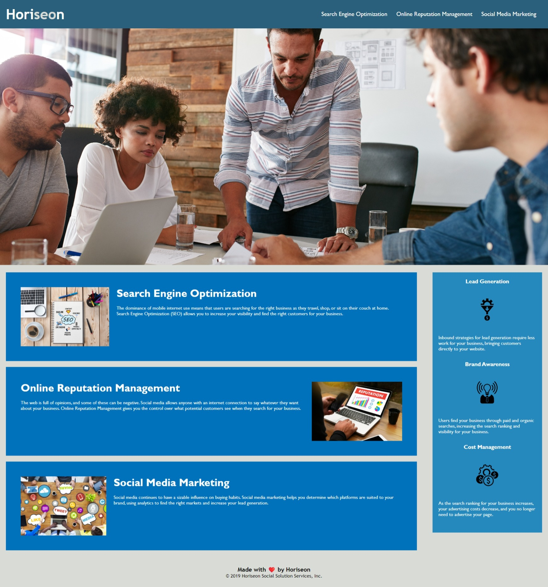

# Module-1-Challenge-Horiseon

## Description
This project is the first challenge of my Rice Coding Bootcamp. The main goal of the project was to refactor the code so that it follows accessibility standards to optimize the site for search engines. I also consolidated some css elements and attributes, changed some elements to semantic html elements, fixed broken links, and restructured the code to follow more logical structure. I learned a lot about how to properly structure HTML, and CSS files as well as how to improve accessibility.

## Installation
There is no installation required for this project. Just follow the URL for the webpage and you can view the code in the inspector for the DevTools.

## Usage
Go to the url https://adamhood15.github.io/module-1-challenge-horiseon/ to see the live webpage. Below is a screenshot of the finished product. 

## Credits
I am the sole collaborator on this project. The starter code was provided to me by the Rice Coding Bootcamp.

## License
Please refer to the license in the repo.